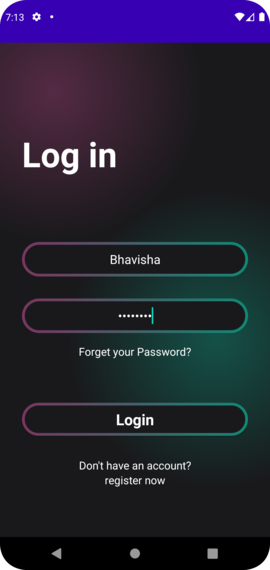

# Movies Application

The Movies Application is an Android application that provides users with information about movies. Users can view the latest and new movies, and filter movies based on search criteria.

## Features

- **Intro Screen:** A welcoming introduction to the application.
- **Login:** Secure user authentication.
- **Latest Movies:** Display the most recent movies.
- **New Movies:** Display newly released movies.
- **Search Functionality:** Search for movies based on keywords.
- **User-friendly Interface:** Simple and intuitive design for easy navigation.

## Screenshots





## Installation

1. **Clone the repository:**
    ```sh
    git clone https://github.com/bhavisha-khatri/movie.git
    ```
2. **Open the project in Android Studio:**
    - Open Android Studio.
    - Click on `File > Open`.
    - Navigate to the cloned repository directory and click `OK`.
3. **Build the project:**
    - Click on `Build > Rebuild Project` to build the project.

4. **Run the application:**
    - Connect your Android device or start an emulator.
    - Click on `Run > Run 'app'` to install and run the application on your device/emulator.

## Usage

1. **Intro Screen:**
    - The intro screen welcomes the user to the application and provides a brief overview.

2. **Login:**
    - Securely log in to access personalized features.

3. **Latest Movies:**
    - View a list of the latest movies available.

4. **New Movies:**
    - Browse newly released movies.

5. **Search Functionality:**
    - Use the search feature to find movies based on specific keywords.

## Technologies Used

- **Programming Language:** Java
- **Libraries:**
    - Retrofit for network requests
    - Glide for image loading
    - LiveData and ViewModel for data binding
    - RecyclerView for displaying lists
    - Navigation Component for handling navigation


